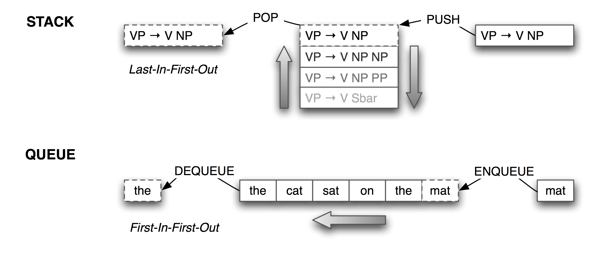

.. -*- mode: rst -*-
.. include:: ../definitions.rst

.. standard global imports

    >>> import nltk, re, pprint

.. TODO: transformation based learning?
.. TODO: indexing and space-time trade-offs (more efficient concordancing, fuzzy spelling)
.. TODO: persistent storage (shelve)
.. TODO: indexing and searching a corpus, cf VITTA talk, or Ingrid's lexicon spreadsheet inversion
.. TODO: SIPs exercise
.. TODO: explain the relationship between list comprehension argument and generator expression argument; say that we oversimplified in chapter 6
.. TODO: cover generator expressions, as promised in words chapter.
.. TODO: architectures: pipeline/cascade vs blackboard
.. TODO: lexical chaining for text segmentation, or WSD
.. TODO: multicomponent systems and APIs: spelling correction, web search
.. TODO: explain why a program should not usually import all of NLTK.

.. _chap-applied-programming:

=======================================
4. Writing Structured Programs (Extras)
=======================================

This chapter introduces concepts in algorithms, data structures,
program design, and applied Python programming. It also contains
review of the basic mathematical notions of set, relation, and
function, and illustrates them in terms of Python data structures.
It contains many working program fragments that you should try yourself.

------------------------------------
The Practice of Software Development
------------------------------------

``http://www.jwz.org/doc/worse-is-better.html``

``http://c2.com/cgi/wiki?DontRepeatYourself``

``import this``

* Pages on Python pitfalls.

-------------------
Abstract Data Types
-------------------

Stacks and Queues
-----------------

Lists are a versatile data type.  We can use lists to
implement so-called `abstract data types`:dt: such as stacks and queues.
A `stack`:dt: is a container that has a last-in-first-out (or LIFO) policy
for adding and removing items (see fig-stack-queue_).

.. _fig-stack-queue:

   Stacks and Queues

Stacks are used to keep track of the current context in
computer processing of natural languages (and programming languages too).
We will seldom have to deal with stacks explicitly, as the implementation
of |NLTK| parsers, treebank corpus readers, (and even Python functions),
all use stacks behind the scenes.
However, it is important to understand what stacks are and how they work.

.. pylisting:: code-check-parens
   :caption: Check whether parentheses are balanced

   def check_parens(tokens):
       stack = []
       for token in tokens:
           if token == '(':     # push
               stack.append(token)
           elif token == ')':   # pop
               stack.pop()
       return stack

   >>> phrase = "( the cat ) ( sat ( on ( the mat )"
   >>> print check_parens(phrase.split())
   ['(', '(']

.. Adam: what this code does is funny: in some cases of unbalanced parens it
   returns a non-empty stack, as in the example in the book, in other
   cases -- it just fails (e.g., for ")(").

In Python, we can treat a list as a stack by limiting ourselves to the three
operations defined on stacks: ``append(item)`` (to push ``item`` onto the stack),
``pop()`` to pop the item off the top of the stack, and ``[-1]`` to access the
item on the top of the stack.  The program in code-check-parens_ processes a sentence with
phrase markers, and checks that the parentheses are balanced.
The loop pushes material onto the stack when it gets an open parenthesis,
and pops the stack when it gets a close parenthesis.
We see that two are left on the stack at the end;
i.e. the parentheses are not balanced.

.. Adam: And certainly the bit of code in text involving "phrase.count" does
         not do the same -- it returns True for ")(".

Although the program in code-check-parens_ is a useful illustration of stacks,
it is overkill because we could have done a direct count:
``phrase.count('(') == phrase.count(')')``.  However, we
can use stacks for more sophisticated processing of strings
containing nested structure, as shown in code-convert-parens_.
Here we build a (potentially deeply-nested) list of lists.
Whenever a token other than a parenthesis is encountered,
we add it to a list at the appropriate level of nesting.
The stack keeps track of this level of nesting, exploiting
the fact that the item at the top of the stack is actually shared with a
more deeply nested item.  (Hint: add diagnostic print statements to
the function to help you see what it is doing.)

.. pylisting:: code-convert-parens
   :caption: Convert a nested phrase into a nested list using a stack

   def convert_parens(tokens):
       stack = [[]]
       for token in tokens:
           if token == '(':     # push
               sublist = []
               stack[-1].append(sublist)
               stack.append(sublist)
           elif token == ')':   # pop
               stack.pop()
           else:                # update top of stack
               stack[-1].append(token)
       return stack[0]

   >>> phrase = "( the cat ) ( sat ( on ( the mat ) ) )"
   >>> print convert_parens(phrase.split())
   [['the', 'cat'], ['sat', ['on', ['the', 'branch']]]]    

Lists can be used to represent another important data structure.
A `queue`:dt: is a container that has a first-in-first-out (or FIFO) policy
for adding and removing items (see fig-stack-queue_).
We could use a queue of length `n`:math: to create all the n-grams of a text.
As with stacks, we will seldom have to deal with queues explicitly,
as the implementation of |NLTK| n-gram taggers (sec-n-gram-tagging_)
and chart parsers use queues behind the scenes.
Here's how queues can be implemented using lists.

    >>> queue = ['the', 'cat', 'sat']
    >>> queue.append('on')
    >>> queue.append('the')
    >>> queue.append('branch')
    >>> queue.pop(0)
    'the'
    >>> queue.pop(0)
    'cat'
    >>> queue
    ['sat', 'on', 'the', 'branch']

.. note::
   The list-based implementation of queues is inefficient for large queues.
   In such cases, it is better to use Python's built-in support for
   "double-ended queues", ``collections.deque``.

---------------
Chinese and XML
---------------

Codecs for processing Chinese text have been incorporated into Python
(since version 2.4). 

    >>> path = nltk.data.find('samples/sinorama-gb.xml')
    >>> f = codecs.open(path, encoding='gb2312')
    >>> lines = f.readlines()
    >>> for l in lines:
    ...     l = l[:-1]
    ...     utf_enc = l.encode('utf8')
    ...     print repr(utf_enc)
    '<?xml version="1.0" encoding="gb2312" ?>'
    ''
    '<sent>'
    '\xe7\x94\x9a\xe8\x87\xb3\xe7\x8c\xab\xe4\xbb\xa5\xe4\xba\xba\xe8\xb4\xb5'
    ''
    'In some cases, cats were valued above humans.'
    '</sent>'

With appropriate support on your terminal, the escaped text string
inside the ``<SENT>`` element above
will be rendered as the following string of ideographs:
|CJK-751a|\ |CJK-81f3|\ |CJK-732b|\ |CJK-4ee5|\ |CJK-4eba|\ |CJK-8d35|.

We can also read in the contents of an XML file using the ``etree``
package (at least, if the file is encoded as UTF-8 |mdash| as of
writing, there seems to be a problem reading GB2312-encoded files in
``etree``).

    >>> path = nltk.data.find('samples/sinorama-utf8.xml')
    >>> from nltk.etree import ElementTree as ET
    >>> tree = ET.parse(path)
    >>> text = tree.findtext('sent')
    >>> uni_text = text.encode('utf8')
    >>> print repr(uni_text.splitlines()[1])
    '\xe7\x94\x9a\xe8\x87\xb3\xe7\x8c\xab\xe4\xbb\xa5\xe4\xba\xba\xe8\xb4\xb5'

-----------------------------
More on Defensive Programming
-----------------------------

The Return Statement
--------------------

Another aspect of defensive programming concerns the return statement of a function.
In order to be confident that all execution paths through a function lead to a
return statement, it is best to have a single return statement at the end of
the function definition.
This approach has a further benefit: it makes it more likely that the
function will only return a single type.
Thus, the following version of our ``tag()`` function is safer.
First we assign a default value default-value_, then in certain
cases certain-cases_ we replace it with a different value different-value_.
All paths through the function body end at the single return statement single-return_.

    >>> def tag(word):
    ...     result = 'noun' # [_default-value]
    ...     if word in ['a', 'the', 'all']: # [_certain-cases]
    ...         result = 'det' # [_different-value]
    ...     return result # [_single-return]

A return statement can be used to pass multiple values back to the calling
program, by packing them into a tuple.
Here we define a function that returns a tuple
consisting of the average word length of a sentence, and the inventory
of letters used in the sentence.  It would have been clearer to write
two separate functions.

    >>> def proc_words(words):
    ...     avg_wordlen = sum(len(word) for word in words)/len(words)
    ...     chars_used = ''.join(sorted(set(''.join(words))))
    ...     return avg_wordlen, chars_used
    >>> proc_words(['Not', 'a', 'good', 'way', 'to', 'write', 'functions'])
    (3, 'Nacdefginorstuwy')

[write version with two separate functions]

----------------
Algorithm Design
----------------

An *algorithm* is a "recipe" for solving a problem.  For example,
to multiply 16 by 12 we might use any of the following methods:

1. Add 16 to itself 12 times over
#. Perform "long multiplication", starting with the least-significant
   digits of both numbers
#. Look up a multiplication table
#. Repeatedly halve the first number and double the second,
   16*12 = 8*24 = 4*48 = 2*96 = 192
#. Do 10*12 to get 120, then add 6*12
#. Rewrite 16*12 as (x+2)(x-2), remember that 14*14=196, and add (+2)(-2) = -4

Each of these methods is a different algorithm, and requires different
amounts of computation time and different amounts of intermediate
information to store.  A similar situation holds for many other
superficially simple tasks, such as sorting a list of words.

Sorting Algorithms
------------------

Now, as we saw above, Python provides a built-in function ``sort()`` that
performs this task efficiently.  However, NLTK also provides
several algorithms for sorting lists, to illustrate the variety of
possible methods.  To illustrate the difference in efficiency, we
will create a list of 1000 numbers, randomize the list, then sort it,
counting the number of list manipulations required.

  >>> from random import shuffle
  >>> a = range(1000)                     # [0,1,2,...999]
  >>> shuffle(a)                          # randomize

Now we can try a simple sort method called *bubble sort*, that
scans through the list many times, exchanging adjacent items if
they are out of order.  It sorts the list ``a`` in-place, and returns
the number of times it modified the list:

  >>> from nltk.misc import sort
  >>> sort.bubble(a)
  250918

We can try the same task using various sorting algorithms.  Evidently
*merge sort* is much better than bubble sort, and *quicksort* is better still.

  >>> shuffle(a); sort.merge(a)
  6175
  >>> shuffle(a); sort.quick(a)
  2378

Readers are encouraged to look at ``nltk.misc.sort`` to see how
these different methods work.  The collection of NLTK modules
exemplify a variety of algorithm design techniques, including
brute-force, divide-and-conquer, dynamic programming, and greedy search.
Readers who would like a systematic introduction to algorithm design
should consult the resources mentioned at the end of this tutorial.

Decorate-Sort-Undecorate
------------------------

In chap-structured-programming_ we saw how to sort a list of items
according to some property of the list.

    >>> words = 'I turned off the spectroroute'.split()
    >>> words.sort(cmp)
    >>> words
    ['I', 'off', 'spectroroute', 'the', 'turned']
    >>> words.sort(lambda x, y: cmp(len(y), len(x)))
    >>> words
    ['spectroroute', 'turned', 'off', 'the', 'I']

This is inefficient when the list of items gets long, as
we compute ``len()`` twice for every comparison (about 2nlog(n) times).
The following is more efficient:

    >>> [pair[1] for pair in sorted((len(w), w) for w in words)[::-1]]
    ['spectroroute', 'turned', 'the', 'off', 'I']

This technique is called `decorate-sort-undecorate`:dt:.
We can compare its performance by timing how long it takes to
execute it a million times.

    >>> from timeit import Timer
    >>> Timer("sorted(words, lambda x, y: cmp(len(y), len(x)))",
    ...       "words='I turned off the spectroroute'.split()").timeit()
    8.3548779487609863
    >>> Timer("[pair[1] for pair in sorted((len(w), w) for w in words)]",
    ...      "words='I turned off the spectroroute'.split()").timeit()
    9.9698889255523682
    
MORE: consider what happens as the lists get longer...

.. finding maximum value of list: sort() vs max()

Another example: sorting dates of the form "1 Jan 1970"

    >>> month_index = {
    ...     "Jan" : 1, "Feb" : 2,  "Mar" : 3,  "Apr" : 4,
    ...     "May" : 5, "Jun" : 6,  "Jul" : 7,  "Aug" : 8,
    ...     "Sep" : 9, "Oct" : 10, "Nov" : 11, "Dec" : 12
    ... }
    >>> def date_cmp(date_string1, date_string2):
    ...     (d1,m1,y1) = date_string1.split()
    ...     (d2,m2,y2) = date_string2.split()
    ...     conv1 = y1, month_index[m1], d1
    ...     conv2 = y2, month_index[m2], d2
    ...     return cmp(a2, b2)
    >>> sort(date_list, date_cmp)

The comparison function says that we compare two times of the
form ``('Mar', '2004')`` by reversing the order of the month and
year, and converting the month into a number to get ``('2004', '3')``,
then using Python's built-in ``cmp`` function to compare them.

Now do this using decorate-sort-undecorate, for large data size

Time comparison

Brute Force
-----------

Wordfinder Puzzle

Here we will generate a grid of letters, containing words found in the
dictionary.  First we remove any duplicates and disregard the order in
which the lexemes appeared in the dictionary.  We do this by converting
it to a set, then back to a list.  Then we select the first 200 words,
and then only keep those words having a reasonable length.

    >>> words = list(set(lexemes))
    >>> words = words[:200]
    >>> words = [w for w in words if 3 <= len(w) <= 12]

Now we generate the wordfinder grid, and print it out.

    >>> from nltk.misc.wordfinder import wordfinder
    >>> grid, used = wordfinder(words)
    >>> for i in range(len(grid)):
    ...     for j in range(len(grid[i])):
    ...         print grid[i][j],
    ...     print
    O G H K U U V U V K U O R O V A K U N C
    K Z O T O I S E K S N A I E R E P A K C
    I A R A A K I O Y O V R S K A W J K U Y
    L R N H N K R G V U K G I A U D J K V N
    I I Y E A U N O K O O U K T R K Z A E L
    A V U K O X V K E R V T I A A E R K R K
    A U I U G O K U T X U I K N V V L I E O
    R R K O K N U A J Z T K A K O O S U T R
    I A U A U A S P V F O R O O K I C A O U
    V K R R T U I V A O A U K V V S L P E K
    A I O A I A K R S V K U S A A I X I K O
    P S V I K R O E O A R E R S E T R O J X
    O I I S U A G K R O R E R I T A I Y O A
    R R R A T O O K O I K I W A K E A A R O
    O E A K I K V O P I K H V O K K G I K T
    K K L A K A A R M U G E P A U A V Q A I
    O O O U K N X O G K G A R E A A P O O R
    K V V P U J E T Z P K B E I E T K U R A
    N E O A V A E O R U K B V K S Q A V U E
    C E K K U K I K I R A E K O J I Q K K K

Finally we generate the words which need to be found.

    >>> for i in range(len(used)):
    ...     print "%-12s" % used[i],
    ...     if float(i+1)%5 == 0: print
    KOKOROPAVIRA KOROROVIVIRA KAEREASIVIRA KOTOKOTOARA  KOPUASIVIRA 
    KATAITOAREI  KAITUTUVIRA  KERIKERISI   KOKARAPATO   KOKOVURITO  
    KAUKAUVIRA   KOKOPUVIRA   KAEKAESOTO   KAVOVOVIRA   KOVAKOVARA  
    KAAREKOPIE   KAEPIEVIRA   KAPUUPIEPA   KOKORUUTO    KIKIRAEKO   
    KATAAVIRA    KOVOKOVOA    KARIVAITO    KARUVIRA     KAPOKARI    
    KUROVIRA     KITUKITU     KAKUPUTE     KAEREASI     KUKURIKO    
    KUPEROO      KAKAPUA      KIKISI       KAVORA       KIKIPI      
    KAPUA        KAARE        KOETO        KATAI        KUVA        
    KUSI         KOVO         KOAI       

Problem Transformation (aka Transform-and-Conquer)
--------------------------------------------------

Find words which, when reversed, make legal words.
Extremely wasteful brute force solution:

    >>> words = nltk.corpus.words.words('en')
    >>> for word1 in words:
    ...     for word2 in words:
    ...         if word1 == word2[::-1]:
    ...             print word1
    
More efficient:

    >>> wordlist = set(words)
    >>> rev_wordlist = set(word[::-1] for word in words)
    >>> sorted(wordlist.intersection(rev_wordlist))
    ['ah', 'are', 'bag', 'ban', 'bard', 'bat', 'bats', 'bib', 'bob', 'boob', 'brag',
    'bud', 'buns', 'bus', 'but', 'civic', 'dad', 'dam', 'decal', 'deed', 'deeps', 'deer',
    'deliver', 'denier', 'desserts', 'deus', 'devil', 'dial', 'diaper', 'did', 'dim',
    'dog', 'don', 'doom', 'drab', 'draw', 'drawer', 'dub', 'dud', 'edit', 'eel', 'eke',
    'em', 'emit', 'era', 'ere', 'evil', 'ewe', 'eye', 'fires', 'flog', 'flow', 'gab',
    'gag', 'garb', 'gas', 'gel', 'gig', 'gnat', 'god', 'golf', 'gulp', 'gum', 'gums',
    'guns', 'gut', 'ha', 'huh', 'keel', 'keels', 'keep', 'knits', 'laced', 'lager',
    'laid', 'lap', 'lee', 'leek', 'leer', 'leg', 'leper', 'level', 'lever', 'liar',
    'live', 'lived', 'loop', 'loops', 'loot', 'loots', 'mad', 'madam', 'me', 'meet', 
    'mets', 'mid', 'mood', 'mug', 'nab', 'nap', 'naps', 'net', 'nip', 'nips', 'no',
    'nod', 'non', 'noon', 'not', 'now', 'nun', 'nuts', 'on', 'pal', 'pals', 'pan',
    'pans', 'par', 'part', 'parts', 'pat', 'paws', 'peek', 'peels', 'peep', 'pep',
    'pets', 'pin', 'pins', 'pip', 'pit', 'plug', 'pool', 'pools', 'pop', 'pot', 'pots',
    'pup', 'radar', 'rail', 'rap', 'rat', 'rats', 'raw', 'redder', 'redraw', 'reed',
    'reel', 'refer', 'regal', 'reined', 'remit', 'repaid', 'repel', 'revel', 'reviled',
    'reviver', 'reward', 'rotator', 'rotor', 'sag', 'saw', 'sees', 'serif', 'sexes',
    'slap', 'sleek', 'sleep', 'sloop', 'smug', 'snap', 'snaps', 'snip', 'snoops',
    'snub', 'snug', 'solos', 'span', 'spans', 'spat', 'speed', 'spin', 'spit', 'spool',
    'spoons', 'spot', 'spots', 'stab', 'star', 'stem', 'step', 'stew', 'stink', 'stool',
    'stop', 'stops', 'strap', 'straw', 'stressed', 'stun', 'sub', 'sued', 'swap', 'tab',
    'tang', 'tap', 'taps', 'tar', 'teem', 'ten', 'tide', 'time', 'timer', 'tip', 'tips',
    'tit', 'ton', 'tool', 'top', 'tops', 'trap', 'tub', 'tug', 'war', 'ward', 'warder',
    'warts', 'was', 'wets', 'wolf', 'won']

Observe that this output contains redundant information; each word and its reverse is
included.  How could we remove this redundancy?

Presorting, sets:

Find words which have at least (or exactly) one instance of all vowels.
Instead of writing extremely complex regular expressions, some simple preprocessing
does the trick:

    >>> words = ["sequoia", "abacadabra", "yiieeaouuu!"]
    >>> vowels = "aeiou"
    >>> [w for w in words if set(w).issuperset(vowels)]
    ['sequoia', 'yiieeaouuu!']
    >>> [w for w in words if sorted(c for c in w if c in vowels) == list(vowels)]
    ['sequoia']

Space-Time Tradeoffs
--------------------

Indexing

Fuzzy Spelling

---------
Exercises
---------

#. |soso| Consider again the problem of hyphenation across line-breaks.
   Suppose that you have successfully written a tokenizer that
   returns a list of strings, where some strings may contain
   a hyphen followed by a newline character, e.g. ``long-\nterm``.
   Write a function that iterates over the tokens in a list,
   removing the newline character from each, in each of the following
   ways:

   a) Use doubly-nested for loops.  The outer loop will iterate over
      each token in the list, while the inner loop will iterate over
      each character of a string.

   b) Replace the inner loop with a call to ``re.sub()``

   c) Finally, replace the outer loop with call to the ``map()``
      function, to apply this substitution to each token.

   d) Discuss the clarity (or otherwise) of each of these approaches.

------
Search
------

Many NLP tasks can be construed as search problems.
For example, the task of a parser is to identify one or more
parse trees for a given sentence.  As we saw in Part II,
there are several algorithms for parsing.  A `recursive descent parser`:idx:
performs `backtracking search`:dt:, applying grammar productions in turn
until a match with the next input word is found, and backtracking when
there is no match.  As we will see in sec-grammar-development_,
the space of possible parse trees is very large; a parser can be thought
of as providing a relatively efficient way to find the right solution(s)
within a very large space of candidates.

As another example of search, suppose we want to find the most complex
sentence in a text corpus.  Before we can begin we have to be explicit
about how the complexity of a sentence is to be measured: word count,
verb count, character count, parse-tree depth, etc.  In the context
of learning this is known as the `objective function`:dt:, the property
of candidate solutions we want to optimize.

Exhaustive Search
-----------------

* brute-force approach
* enumerate search space, evaluate at each point
* this example: search space size is 2\ `55`:superscript: = 36,028,797,018,963,968

For a computer that can do 100,000 evaluations per second, this
would take over 10,000 years!

Backtracking search -- saw this in the recursive descent parser.

Hill-Climbing Search
--------------------

Starting from a given location in the search space, evaluate nearby locations and move to
a new location only if it is an improvement on the current location.

.. pylisting:: code-hill-climb
   :caption: Hill-Climbing Search

   def flip(segs, pos):
       return segs[:pos] + `1-int(segs[pos])` + segs[pos+1:]
   def hill_climb(text, segs, iterations):
       for i in range(iterations):
           pos, best = 0, evaluate(text, segs)
           for i in range(len(segs)):
               score = evaluate(text, flip(segs, i))
               if score < best:
                   pos, best = i, score
           if pos != 0:
               segs = flip(segs, pos)
               print evaluate(text, segs), segment(text, segs)
       return segs

   >>> print evaluate(text, seg1), segment(text, seg1)
   63 ['doyouseethekitty', 'seethedoggy', 'doyoulikethekitty', 'likethedoggy']
   >>> hill_climb(text, seg1, 20)
   61 ['doyouseethekittyseethedoggy', 'doyoulikethekitty', 'likethedoggy']
   59 ['doyouseethekittyseethedoggydoyoulikethekitty', 'likethedoggy']
   57 ['doyouseethekittyseethedoggydoyoulikethekittylikethedoggy']

---------------------------------------------
Object-Oriented Programming in Python (DRAFT)
---------------------------------------------

Object-Oriented Programming is a programming paradigm in which
complex structures and processes are decomposed into `classes`:dt:,
each encapsulating a single data type and the legal operations on
that type.  In this section we show you how to create simple data
classes and processing classes by example.  For a systematic
introduction to Object-Oriented design, please consult the large
literature of books on this topic.

Data Classes: Trees in NLTK
---------------------------

An important data type in language processing is the syntactic tree.
Here we will review the parts of the NLTK code that defines the ``Tree``
class.  

The first line of a class definition is the ``class`` keyword followed
by the class name, in this case ``Tree``.  This class is derived from
Python's built-in ``list`` class, permitting us to use standard list
operations to access the children of a tree node.

    >>> class Tree(list):

Next we define the `initializer`:dt: ``__init__()``;
Python knows to call this function when you ask for a new tree object
by writing ``t = Tree(node, children)``.  The constructor's first argument
is special, and is standardly called ``self``, giving us a way to
refer to the current object from within its definition.  This
particular constructor calls the list initializer (similar to calling ``self =
list(children)``), then defines the ``node`` property of a tree.

.. doctest-ignore::
    ...     def __init__(self, node, children):
    ...         list.__init__(self, children)
    ...         self.node = node

Next we define another special function that Python knows to call when
we index a Tree.  The first case is the simplest, when the index is an
integer, e.g. ``t[2]``, we just ask for the list item in the obvious
way.  The other cases are for handling slices, like ``t[1:2]``, or ``t[:]``.

.. doctest-ignore::
    ...     def __getitem__(self, index):
    ...         if isinstance(index, int):
    ...             return list.__getitem__(self, index)
    ...         else:
    ...             if len(index) == 0:
    ...                 return self
    ...             elif len(index) == 1:
    ...                 return self[int(index[0])]
    ...             else:
    ...                 return self[int(index[0])][index[1:]]
    ...     

.. SB: what is the len(index) == 0 case for???

This method was for accessing a child node.  Similar methods are
provided for setting and deleting a child (using ``__setitem__``)
and ``__delitem__``).

Two other special member functions are ``__repr__()`` and ``__str__()``.
The ``__repr__()`` function produces a string representation of the
object, one that can be executed to re-create the object, and is
accessed from the interpreter simply by typing the name of the object
and pressing 'enter'.  The ``__str__()`` function produces a human-readable
version of the object; here we call a pretty-printing function we have
defined called ``pp()``.

.. doctest-ignore::
    ...     def __repr__(self):
    ...         childstr = ' '.join([repr(c) for c in self])
    ...         return '(%s: %s)' % (self.node, childstr)
    ...     def __str__(self):
    ...         return self.pp()

Next we define some member functions that do other standard operations
on trees.  First, for accessing the leaves:

.. doctest-ignore::
    ...     def leaves(self):
    ...         leaves = []
    ...         for child in self:
    ...             if isinstance(child, Tree):
    ...                 leaves.extend(child.leaves())
    ...             else:
    ...                 leaves.append(child)
    ...         return leaves

Next, for computing the height:

.. doctest-ignore::
    ...     def height(self):
    ...         max_child_height = 0
    ...         for child in self:
    ...             if isinstance(child, Tree):
    ...                 max_child_height = max(max_child_height, child.height())
    ...             else:
    ...                 max_child_height = max(max_child_height, 1)
    ...         return 1 + max_child_height

And finally, for enumerating all the subtrees (optionally filtered):

.. doctest-ignore::
    ...     def subtrees(self, filter=None):
    ...         if not filter or filter(self):
    ...             yield self
    ...         for child in self:
    ...             if isinstance(child, Tree):
    ...                 for subtree in child.subtrees(filter):
    ...                     yield subtree

Processing Classes: N-gram Taggers in NLTK
------------------------------------------

This section will discuss the ``tag.ngram`` module.

Duck Typing
-----------

[to be written]

[Hunt2000]_

.. include:: footer.rst

