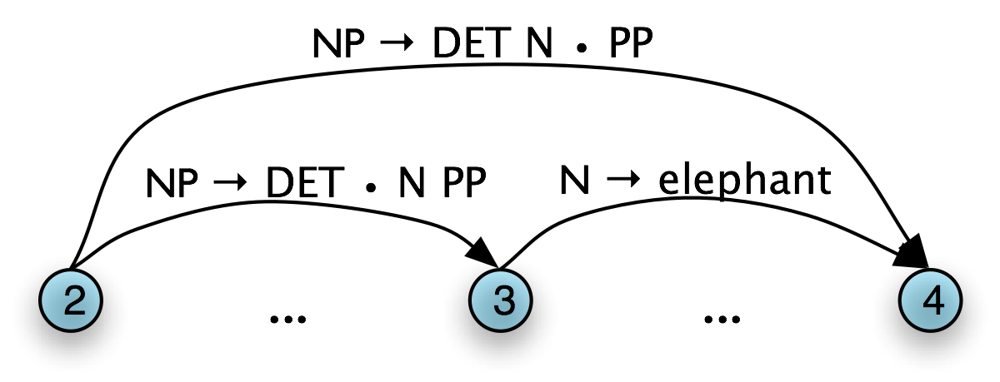
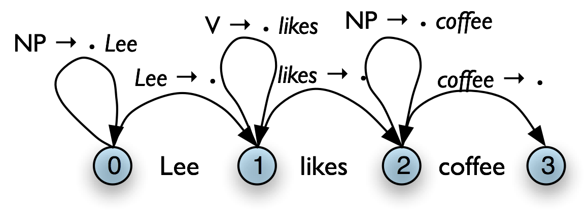
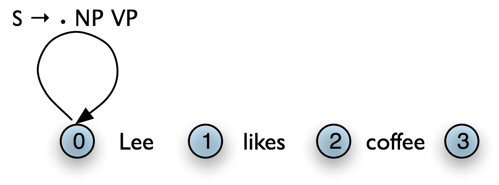
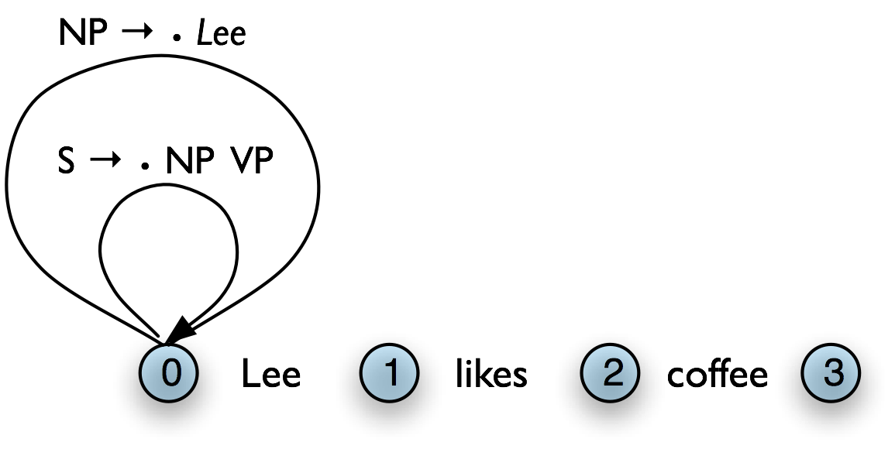
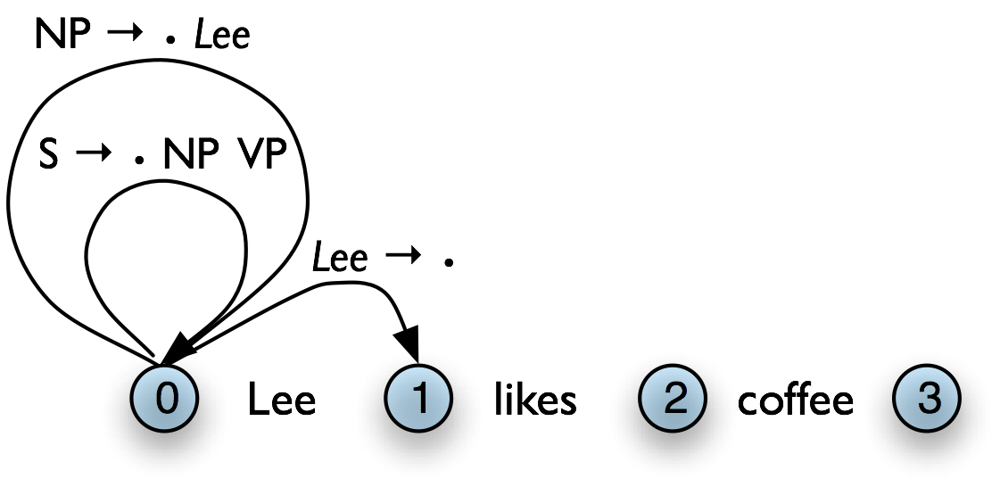

.. -*- mode: rst -*-
.. include:: ../definitions.rst

========================================
8. Analyzing Sentence Structure (Extras)
========================================

-------------------
Chunking vs Parsing
-------------------

You might be asking what's new about phrasal constituents, since they
are very similar to the chunks presented in chap-chunk_. To
answer this, let's return to the challenge of making explicit how a
sentence says "who did what to whom". Let's just focus for a while on
the "who" part of this story. As a first approximation, we'll say that
this amounts to telling what the grammatical subject of a sentence
is. Can we do this using chunks? Based on the techniques described in
chap-chunk_, a chunking analysis of ex-bb0_ will look as
follows:

::

    (S
      (NP the/DT little/JJ bear/NN)
      saw/VBD
      (NP the/DT fine/JJ fat/JJ trout/NN)
      in/IN
      (NP the/DT brook/NN))

.. XXX "So we might adopt the heuristic that" -> "Suppose that"

So we might adopt the heuristic that the subject of a sentence is the
``NP`` chunk that immediately precedes the tensed verb: this would
correctly yield ``(NP the/DT little/JJ bear/NN)`` as
subject. Unfortunately, this simple rule very quickly fails, as shown
by a more complex example.

    >>> from nltk.corpus import conll2000
    >>> print conll2000.chunked_sents()[1]
    (S
      Chancellor/NNP
      (PP of/IN)
      (NP the/DT Exchequer/NNP)
      (NP Nigel/NNP Lawson/NNP)
      (NP 's/POS restated/VBN commitment/NN)
      (PP to/TO)
      (NP a/DT firm/NN monetary/JJ policy/NN)
      (VP has/VBZ helped/VBN to/TO prevent/VB)
      (NP a/DT freefall/NN)
      (PP in/IN)
      (NP sterling/NN)
      (PP over/IN)
      (NP the/DT past/JJ week/NN)
      ./.)

What's doing the "preventing" in this example is not the firm monetary
policy, but rather the restated commitment to such a policy. We can
also see from this example that a different simple rule, namely
treating the initial ``NP`` chunk  as the subject, also fails, since this
would give us the ``(NP the/DT Exchequer/NNP)``. By contrast, a
complete phrase structure analysis of
the sentence would group together all the pre-verbal ``NP`` chunks
into a single ``NP`` constituent:

.. ex:: 
    .. tree:: (NP(NP (NP (Nom (N Chancellor) (PP (P of)(NP (Det the) (N Exchequer))))(NP Nigel Lawson)) (POSS 's))(Nom (Adj restated)(Nom (N commitment)(PP (P to)(NP (Det a)(Nom (Adj firm) (Nom (Adj monetary)(Nom (N policy)))))))))
       :scale: 80:80:50

We still have a little work to determine which part of this complex
``NP`` corresponds to the "who", but nevertheless, this is much
more tractable than answering the same question from a flat sequence
of chunks.

"Subject" and "direct object" are examples of `grammatical
functions`:dt:. Although they are not captured directly in a phrase
structure grammar, they can be defined in terms of tree
configurations. In ex-gfs_, the subject of ``S`` is the ``NP``
immediately dominated by  ``S`` while the direct object of ``V``
is the ``NP`` directly dominated by ``VP``.

.. _ex-gfs:
.. ex::
    .. tree:: (S <NP \ > <VP V NP ...>)

-------------
Chart Parsing
-------------

Chart Parsing is a parsing algorithm that uses dynamic programming,
a technique described in sec-algorithm-design_.
It extends the method of well-formed substring tables from
sec-parsing_.

Active Charts
-------------

The content of a WFST can be represented in a directed acyclic graph,
as shown in ex-chartinita_ for the initialized WFST and
ex-chartinitb_ for the completed WFST.

.. ex::

  .. _ex-chartinita:
  .. ex::
      .. image:: ../images/chart_wfst1.png
         :scale: 25:75:25

  .. _ex-chartinitb:
  .. ex::
     .. image:: ../images/chart_wfst2.png
        :scale: 25:75:25

In general, a chart parser hypothesizes constituents (i.e. adds edges)
based on the grammar, the tokens, and the constituents already found.
Any constituent that is compatible with the current knowledge can be hypothesized;
even though many of these hypothetical constituents will never be used in
the final result.  A |WFST| just records these hypotheses.

All of the edges that we've seen so far represent complete
constituents.  However, it is helpful to record
*incomplete* constituents, to document the work
already done by the parser.  For example, when a
top-down parser processes *VP* |rarr| *V* *NP* *PP*,
it may find *V* and *NP* but not the *PP*.  This work
can be reused when processing *VP* |rarr| *V* *NP*.
Thus, we will record the
hypothesis that "the ``V`` constituent `likes`:lx: is the beginning of a ``VP``."

We can do this by adding a `dot`:dt: to the edge's right hand side.
Material to the left of the dot records what has been found so far;
material to the right of the dot specifies what still needs to be found in order
to complete the constituent.  For example, the edge in
ex-dottededge_ records the hypothesis that "a ``VP`` starts with the ``V``
`likes`:lx:, but still needs an ``NP`` to become complete":

.. _ex-dottededge:
.. ex::
   .. image:: ../images/chart_intro_dottededge.png
      :scale: 30:75:75

These `dotted edges`:dt: are used to record all of the hypotheses that a
chart parser makes about constituents in a sentence.

Types of Edge
-------------

Let's take stock.
An edge [``VP`` |rarr| |dot| ``V`` ``NP`` ``PP``, (*i*, *i*)]
records the hypothesis that a ``VP`` begins at location *i*, and that we anticipate
finding a sequence ``V NP PP`` starting here.  This is known as a
`self-loop edge`:dt:; see ex-chart-intro-selfloop_.
An edge [``VP`` |rarr| ``V`` |dot| ``NP`` ``PP``, (*i*, *j*)]
records the fact that we have discovered a ``V`` spanning (*i*, *j*),
and hypothesize a following ``NP PP`` sequence to complete a ``VP``
beginning at *i*.  This is known as an `incomplete edge`:dt:;
see ex-chart-intro-incomplete_.
An edge [``VP`` |rarr| ``V`` ``NP`` ``PP`` |dot| , (*i*, *k*)]
records the discovery that a ``VP`` consisting of the sequence
``V NP PP`` has been discovered for the span (*i*, *j*).  This is known
as a `complete edge`:dt:; see ex-chart-intro-parseedge_.
If a complete edge spans the entire sentence, and has the grammar's
start symbol as its left-hand side, then the edge is called a `parse
edge`:dt:, and it encodes one or more parse trees for the sentence;
see ex-chart-intro-parseedge_.

.. ex::

   .. _ex-chart-intro-selfloop:
   .. ex::
      .. image:: ../images/chart_intro_selfloop.png
         :scale: 25

   .. _ex-chart-intro-incomplete:
   .. ex::
      .. image:: ../images/chart_intro_incomplete.png
         :scale: 25:25:75

   .. _ex-chart-intro-parseedge:
   .. ex::
      .. image:: ../images/chart_intro_parseedge.png
         :scale: 25

The Chart Parser
----------------

To parse a sentence, a chart parser first creates an empty chart
spanning the sentence.  It then finds edges that are licensed by its
knowledge about the sentence, and adds them to the chart one at a time
until one or more parse edges are found.  The edges that it adds can
be licensed in one of three ways:

i. The *input* can license an edge: each word `w`:sub:`i`
   in the input licenses the complete edge [`w`:sub:`i` |rarr|
   |dot|, (*i*, *i*\ +1)].

#. The *grammar* can license an edge: each grammar
   production A |rarr| |alpha| licenses the self-loop edge [*A* |rarr|
   |dot| |alpha|, (*i*, *i*)] for every *i*, 0 |leq| *i* < *n*.

#. The *current chart contents* can license an edge:
   a suitable pair of existing edges triggers the addition
   of a new edge. 

Chart parsers use a set of `rules`:dt: to heuristically decide
when an edge should be added to a chart.  This set of rules, along
with a specification of when they should be applied, forms a
`strategy`:dt:.

The Fundamental Rule
--------------------

One rule is particularly important, since it is used by every chart
parser: the `Fundamental Rule`:dt:.  This rule is used to combine an
incomplete edge that's expecting a nonterminal *B* with a following, complete
edge whose left hand side is *B*.  The rule is defined and illustrated in ex-fundamental-rule_.
We will use |alpha|, |beta|, and |gamma| to denote (possibly empty) sequences
of terminals or non-terminals.

.. _ex-fundamental-rule:
.. ex:: `Fundamental Rule`:dt: If the chart contains the edges
   [*A* |rarr| |alpha|\ |dot|\ *B*\ |beta|\ , (*i*, *j*\ )] and
   [*B* |rarr| |gamma|\ |dot|\ , (*j*, *k*\ )] then add a new edge
   [*A* |rarr| |alpha|\ *B*\ |dot|\ |beta|\ , (*i*, *k*)].

   |chart_fundamental|

In the new edge, the dot has moved one place to the right.
Its span is the combined span of the original edges.
Note that in adding this new edge we do not remove the other two,
because they might be used again.

Bottom-Up Parsing
-----------------

As we saw with the shift-reduce parser in sec-parsing_,
bottom-up parsing starts from the input string,
and tries to find sequences of words and phrases that
correspond to the *right hand* side of a grammar production. The
parser then replaces these with the left-hand side of the production,
until the whole sentence is reduced to an ``S``.  Bottom-up chart
parsing is an extension of this approach in which hypotheses about
structure are recorded as edges on a chart. In terms of our earlier
terminology, bottom-up chart parsing can be seen as a parsing
strategy; in other words, bottom-up is a particular choice of
heuristics for adding new edges to a chart. 

The general procedure for chart parsing is
inductive: we start with a base case, and then show how we can move
from a given state of the chart to a new state. Since we are working
bottom-up, the base case for our induction will be determined by the
words in the input string, so we add new edges for each word.  Now,
for the induction step, suppose the chart contains an edge labeled
with constituent *A*. Since we are working bottom-up, we want to build
constituents that can have an *A* as a child. In other words, we
are going to look for productions of the form *B* |rarr| *A* |beta| and use
these to label new edges.

Let's look at the procedure a bit more formally.  To create a
bottom-up chart parser, we add to the Fundamental Rule two new rules:
the `Bottom-Up Initialization Rule`:dt:; and the `Bottom-Up Predict
Rule`:dt:.
The Bottom-Up Initialization Rule says to add all edges licensed by
the input.

.. _ex-bottom-up-initialization-rule:
.. ex:: `Bottom-Up Initialization Rule`:dt: For every word w\ :subscript:`i` add the edge
   [`w`:subscript:`i` |rarr|  |dot| , (*i*, *i*\ +1)]

   |chart_bu_ex1|

.. |chart_bu_ex1| image:: ../images/chart_bu_ex1.png
   :scale: 30

Next, suppose the chart contains a complete edge *e* whose
left hand category is *A*. Then the Bottom-Up Predict Rule requires the
parser to add a self-loop edge at the left boundary of *e*
for each grammar production whose right hand side begins with category
*A*.

.. _ex-bottom-up-predict-rule:
.. ex:: `Bottom-Up Predict Rule`:dt: For each complete edge
   [*A* |rarr| |alpha|\ |dot|\ , (*i*, *j*\ )] and each production
   *B* |rarr| *A*\ |beta|\ , add the self-loop edge
   [*B* |rarr|  |dot|\ *A*\ |beta|\ , (*i*, *i*\ )]

   |chart_bu_ex2|

The next step is to use the Fundamental Rule to add edges
like [``NP`` |rarr| Lee |dot| , (0, 1)],
where we have "moved the dot" one position to the right.
After this, we will now be able to add new self-loop edges such as 
[``S`` |rarr|  |dot| ``NP`` ``VP``, (0, 0)] and
[``VP`` |rarr|  |dot| ``VP`` ``NP``, (1, 1)], and use these to
build more complete edges.

Using these three rules, we can parse a sentence as shown in
ex-bottom-up-strategy_.

.. _ex-bottom-up-strategy:
.. ex::
   `Bottom-Up Strategy`:dt:

   .. parsed-literal::

    Create an empty chart spanning the sentence. 
    Apply the Bottom-Up Initialization Rule to each word. 
    Until no more edges are added: 
      Apply the Bottom-Up Predict Rule everywhere it applies. 
      Apply the Fundamental Rule everywhere it applies. 
    Return all of the parse trees corresponding to the parse edges in the chart. 

.. note:: |TRY|
   |NLTK| provides a useful interactive tool for visualizing the operation of a
   chart parser: ``nltk.app.chartparser()``.
   The tool comes with a pre-defined input string and grammar, but both
   of these can be readily modified with options inside the *Edit* menu.

Top-Down Parsing
----------------

Top-down chart parsing works in a similar way to the recursive descent
parser, in that it starts off with the top-level goal of finding an ``S``.
This goal is broken down into the subgoals of trying to find constituents such as ``NP`` and
``VP`` predicted by the grammar.
To create a top-down chart parser, we use the Fundamental Rule as before plus
three other rules: the `Top-Down Initialization Rule`:dt:, the `Top-Down
Expand Rule`:dt:, and the `Top-Down Match Rule`:dt:.
The Top-Down Initialization Rule in ex-td-init-rule_
captures the fact that the root of any
parse must be the start symbol ``S``\.

.. _ex-td-init-rule:
.. ex:: `Top-Down Initialization Rule`:dt: For each production ``S`` |rarr| |alpha|
   add the self-loop edge [``S`` |rarr| |dot|\ |alpha|\ , (0, 0)]

   |chart_td_ex1|

In our running example, we are predicting that we will be able to find an ``NP`` and a
``VP`` starting at 0, but have not yet satisfied these subgoals.
In order to find an  ``NP`` we need to
invoke a production that has ``NP`` on its left hand side. This work
is done by the Top-Down Expand Rule ex-td-expand-rule_.
This tells us that if our chart contains an incomplete
edge whose dot is followed by a nonterminal *B*, then the parser
should add any self-loop edges licensed by the grammar whose left-hand
side is *B*.

.. _ex-td-expand-rule:
.. ex:: `Top-Down Expand Rule`:dt: For each incomplete edge
   [*A* |rarr| |alpha|\ |dot|\ *B*\ |beta|\ , (*i*, *j*)] and
   for each grammar production *B* |rarr| |gamma|, add the edge
   [*B* |rarr| |dot|\ |gamma|\ , (*j*, *j*\ )]

   |chart_td_ex2|

The Top-Down Match rule allows the predictions of the grammar to be
matched against the input string. Thus, if the chart contains an incomplete
edge whose dot is followed by a terminal *w*, then the parser should
add an edge if the terminal corresponds to the current input symbol.

.. _ex-top-down-match-rule:
.. ex:: `Top-Down Match Rule`:dt: For each incomplete edge
   [*A* |rarr| |alpha|\ |dot|\ w\ :subscript:`j` |beta|\ , (*i*, *j*\ )], 
   where w\ :subscript:`j` is the *j* :sup:`th` word of the input (counting from zero),
   add a new complete edge [`w`:subscript:`j` |rarr| |dot|\ , (*j*, *j*\ +1)]

   |chart_td_ex3|
        

Here we see our example chart after applying the Top-Down Match rule.
After this, we can apply the fundamental rule to
add the edge [``NP`` |rarr| Lee |dot| , (0, 1)].

Using these four rules, we can parse a sentence top-down as shown in
ex-top-down-strategy_.

.. _ex-top-down-strategy:
.. ex::
   `Top-Down Strategy`:dt:

   .. parsed-literal::

    Create an empty chart spanning the sentence. 
    Apply the Top-Down Initialization Rule (at node 0) 
    Until no more edges are added: 
      Apply the Top-Down Expand Rule everywhere it applies. 
      Apply the Top-Down Match Rule everywhere it applies. 
      Apply the Fundamental Rule everywhere it applies. 
    Return all of the parse trees corresponding to the parse edges in
    the chart. 

.. note: |TRY|
   We encourage you to experiment with the |NLTK| chart parser demo,
   as before, in order to test out the top-down strategy yourself.

The Earley Algorithm
--------------------

The Earley algorithm [Earley1970ECF]_ is a parsing strategy that
resembles the Top-Down Strategy, but deals more efficiently with
matching against the input string. tab-earley-terminology_ shows the
correspondence between the parsing rules introduced above and the
rules used by the Earley algorithm.

.. table:: tab-earley-terminology

    +-------------------------------+------------------------------+
    |**Top-Down**\ /**Bottom-Up**   |   **Earley**                 |
    +===============================+==============================+
    | Top-Down Initialization Rule  |  Predictor Rule              |
    | Top-Down Expand Rule          |                              |
    +-------------------------------+------------------------------+
    | Top-Down/Bottom-Up Match Rule |  Scanner Rule                |
    +-------------------------------+------------------------------+
    | Fundamental Rule              |  Completer Rule              |
    +-------------------------------+------------------------------+

    Terminology for rules in the Earley algorithm

Chart Parsing in NLTK
---------------------

NLTK defines a simple yet flexible chart parser,
``ChartParser``.  A new chart parser is constructed from a
grammar and a strategy.  The strategy is applied until no new edges are added to the
chart.
|NLTK| defines two ready-made strategies:
``TD_STRATEGY``, a basic top-down strategy; and ``BU_STRATEGY``, a
basic bottom-up strategy.  When constructing a chart parser, you
can use either of these strategies, or create your own.  We've
already seen how to define a chart parser in sec-dilemmas_.
This time we'll specify a strategy and turn on tracing:

.. doctest-ignore::
    >>> sent = ['I', 'shot', 'an', 'elephant', 'in', 'my', 'pajamas']
    >>> parser = nltk.ChartParser(groucho_grammar, nltk.parse.BU_STRATEGY)
    >>> trees = parser.nbest_parse(sent, trace=2)

.. note: |TRY|
   Try running the above example to view the operation of the chart
   parser in detail.  In the output, ``[-----]`` indicates a complete edge,
   ``>`` indicates a self-loop edge, ``[----->`` indicates an
   incomplete edge, and ``[======]`` indicates a parse edge.

The next two sections introduce two probabilistic parsing algorithms
for PCFGs.  The first is an A* parser that uses dynamic
programming to find the single most likely parse for a given text.
Whenever it finds multiple possible parses for a subtree, it discards
all but the most likely parse.  The second is a bottom-up chart parser
that maintains a queue of edges, and adds them to the chart one at a
time.  The ordering of this queue is based on the probabilities
associated with the edges, allowing the parser to expand more likely
edges before less likely ones.  Different queue orderings are used to
implement a variety of different search strategies.  These algorithms
are implemented in the ``nltk.parse.viterbi`` and
``nltk.parse.pchart`` modules.

A* Parser
---------

An `A* Parser`:dt: is a bottom-up PCFG parser that uses
dynamic programming to find the single most likely parse for a text [Klein2003Astar]_.
It parses texts by iteratively filling in a 
`most likely constituents table`:dt:.  This table records the most likely tree for each
span and node value.  For example, after parsing the sentence "I saw the man with
the telescope" with the grammar ``cfg.toy_pcfg1``, the most likely constituents table
contains the following entries (amongst others):

.. table:: mlct

   ===== ==== ==================================================================  ============
   Span  Node Tree                                                                Prob
   ===== ==== ==================================================================  ============
   [0:1] NP   (NP I)                                                              0.15
   [6:7] NP   (NN telescope)                                                      0.5
   [5:7] NP   (NP the telescope)                                                  0.2
   [4:7] PP   (PP with (NP the telescope))                                        0.122
   [0:4] S    (S (NP I) (VP saw (NP the man)))                                    0.01365
   [0:7] S    (S (NP I) (VP saw (NP (NP the man) (PP with (NP the telescope)))))  0.0004163250
   ===== ==== ==================================================================  ============

   Fragment of Most Likely Constituents Table

Once the table has been completed, the parser
returns the entry for the most likely constituent that spans the
entire text, and whose node value is the start symbol.  For this
example, it would return the entry with a span of [0:6] and a node
value of "S".

Note that we only record the *most likely* constituent for any given
span and node value.  For example, in the table above, there are
actually two possible constituents that cover the span [1:6] and have
"VP" node values.

1. "saw the man, who has the telescope":

  (VP saw
     (NP (NP John)
          (PP with (NP the telescope))))

2. "used the telescope to see the man":

  (VP saw
     (NP John)
     (PP with (NP the telescope)))

|nopar|
Since the grammar we are using to parse the text indicates that the
first of these tree structures has a higher probability, the parser
discards the second one.

**Filling in the Most Likely Constituents Table:**
Because the grammar used by ``ViterbiParse`` is a PCFG, the
probability of each constituent can be calculated from the
probabilities of its children.  Since a constituent's children can
never cover a larger span than the constituent itself, each entry of
the most likely constituents table depends only on entries for
constituents with *shorter* spans (or equal spans, in the case of
unary and epsilon productions).

``ViterbiParse`` takes advantage of this fact, and fills in the most
likely constituent table incrementally.  It starts by filling in the
entries for all constituents that span a single element of text.
After it has filled in all the table entries for constituents that
span one element of text, it fills in the entries for constituents
that span two elements of text.  It continues filling in the entries
for constituents spanning larger and larger portions of the text,
until the entire table has been filled.

To find the most likely constituent with a given span and node value,
``ViterbiParse`` considers all productions that could produce that
node value.  For each production, it checks the most likely
constituents table for sequences of children that collectively cover
the span and that have the node values specified by the production's
right hand side.  If the tree formed by applying the production to the
children has a higher probability than the current table entry, then
it updates the most likely constituents table with the new tree.

**Handling Unary Productions and Epsilon Productions:**
A minor difficulty is introduced by unary productions and epsilon
productions: an entry of the most likely constituents table might
depend on another entry with the same span.  For example, if the
grammar contains the production ``V`` |rarr| ``VP``, then the table
entries for ``VP`` depend on the entries for ``V`` with the same span.
This can be a problem if the constituents are checked in the wrong
order.  For example, if the parser tries to find the most likely
constituent for a ``VP`` spanning [1:3] before it finds the most
likely constituents for ``V`` spanning [1:3], then it can't apply the
``V`` |rarr| ``VP`` production.

To solve this problem, ``ViterbiParse`` repeatedly checks each span
until it finds no new table entries.  Note that cyclic grammar
productions (e.g. ``V`` |rarr| ``V``) will *not* cause this procedure
to enter an infinite loop.  Since all production probabilities are
less than or equal to 1, any constituent generated by a cycle in the
grammar will have a probability that is less than or equal to the
original constituent; so ``ViterbiParse`` will discard it.

In NLTK, we create Viterbi parsers using ``ViterbiParse()``.
Note that since ``ViterbiParse`` only finds the single most likely
parse, that ``nbest_parse()`` will never return more than one parse.

.. pylisting:: code-viterbi-parse
   :caption: Example of a Viterbi Parser

   grammar = nltk.parse_pcfg('''
     NP  -> NNS [0.5] | JJ NNS [0.3] | NP CC NP [0.2]
     NNS -> "cats" [0.1] | "dogs" [0.2] | "mice" [0.3] | NNS CC NNS [0.4]
     JJ  -> "big" [0.4] | "small" [0.6]
     CC  -> "and" [0.9] | "or" [0.1]
     ''')
   viterbi_parser = nltk.ViterbiParser(grammar)

   >>> sent = 'big cats and dogs'.split()
   >>> print viterbi_parser.parse(sent)
   (NP (JJ big) (NNS (NNS cats) (CC and) (NNS dogs))) (p=0.000864)    

The ``trace`` method can be used to set the level of tracing output
that is generated when parsing a text.  Trace output displays the
constituents that are considered, and indicates which ones are added
to the most likely constituent table.  It also indicates the
likelihood for each constituent.

    >>> viterbi_parser.trace(3)
    >>> print viterbi_parser.parse(sent)
    Inserting tokens into the most likely constituents table...
       Insert: |=...| big
       Insert: |.=..| cats
       Insert: |..=.| and
       Insert: |...=| dogs
    Finding the most likely constituents spanning 1 text elements...
       Insert: |=...| JJ -> 'big' [0.4]                 0.4000000000 
       Insert: |.=..| NNS -> 'cats' [0.1]               0.1000000000 
       Insert: |.=..| NP -> NNS [0.5]                   0.0500000000 
       Insert: |..=.| CC -> 'and' [0.9]                 0.9000000000 
       Insert: |...=| NNS -> 'dogs' [0.2]               0.2000000000 
       Insert: |...=| NP -> NNS [0.5]                   0.1000000000 
    Finding the most likely constituents spanning 2 text elements...
       Insert: |==..| NP -> JJ NNS [0.3]                0.0120000000 
    Finding the most likely constituents spanning 3 text elements...
       Insert: |.===| NP -> NP CC NP [0.2]              0.0009000000 
       Insert: |.===| NNS -> NNS CC NNS [0.4]           0.0072000000 
       Insert: |.===| NP -> NNS [0.5]                   0.0036000000 
      Discard: |.===| NP -> NP CC NP [0.2]              0.0009000000 
      Discard: |.===| NP -> NP CC NP [0.2]              0.0009000000 
    Finding the most likely constituents spanning 4 text elements...
       Insert: |====| NP -> JJ NNS [0.3]                0.0008640000 
      Discard: |====| NP -> NP CC NP [0.2]              0.0002160000 
      Discard: |====| NP -> NP CC NP [0.2]              0.0002160000 
    (NP (JJ big) (NNS (NNS cats) (CC and) (NNS dogs))) (p=0.000864)

A Bottom-Up PCFG Chart Parser
-----------------------------

The `A* parser`:idx: described in the previous section finds
the single most likely parse for a given text.  However, when parsers
are used in the context of a larger NLP system, it is often necessary
to produce several alternative parses.  In the context of an overall system,
a parse that is assigned low probability by the parser might still have the
best overall probability.

For example, a probabilistic parser might decide that the most likely
parse for "I saw John with the cookie" is the structure with the
interpretation "I used my cookie to see John"; but that parse would be
assigned a low probability by a semantic system.  Combining the
probability estimates from the parser and the semantic system, the
parse with the interpretation "I saw John, who had my cookie" would be
given a higher overall probability.

A probabilistic bottom-up chart parser
maintains an `edge queue`:dt:, and adds these edges to the chart one at a time.
The ordering of this queue is based on the probabilities associated with the edges,
and this allows the parser to insert the most probable edges first.
Each time an edge is added to the chart, it may become possible
to insert further edges, so these are added to the queue.
The bottom-up chart parser continues adding the edges in the
queue to the chart until enough complete parses have been found, or
until the edge queue is empty.

Like an edge in a regular chart, a probabilistic edge
consists of a dotted production, a span, and a (partial) parse tree.
However, unlike ordinary charts, this time the tree is weighted
with a probability.  Its probability
is the product of the probability of the production that
generated it and the probabilities of its children.  For example, the
probability of the edge ``[Edge: S`` |rarr| ``NP``\ |dot|\ ``VP, 0:2]``
is the probability of the PCFG production ``S`` |rarr| ``NP VP``
multiplied by the probability of its ``NP`` child.
(Note that an edge's tree only includes children for elements to the left
of the edge's dot.)

Bottom-Up PCFG Strategies
-------------------------

The `edge queue`:idx: is a sorted list of edges that can be added to the
chart.  It is initialized with a single edge for each token,
with the form ``[Edge: token`` |rarr| |dot|\ ``]``.
As each edge from the queue is added to the chart, it may
become possible to add further edges, according to two rules:
(i) the Bottom-Up Initialization Rule can be used to add a
self-loop edge whenever an edge whose dot is in position 0 is added to the chart; or
(ii) the Fundamental Rule can be used to combine a new edge
with edges already present in the chart.  These additional edges
are queued for addition to the chart.

By changing the sort order used by the queue, we can control the
strategy that the parser uses to explore the search space.  Since
there are a wide variety of reasonable search strategies,
``BottomUpChartParser()`` does not define any sort order.
Instead, different strategies are implemented in subclasses of ``BottomUpChartParser()``.

.. We should either explain "inside probabilities" or rename this parser (to
        ``LowestCostFirstParser``?). 

**Lowest Cost First:**
The simplest way to order the edge queue is to sort edges by the
probabilities of their associated trees.
This ordering concentrates the efforts of the parser on those edges
that are more likely to be correct analyses of their corresponding
input tokens.
Now, the probability of an edge's tree provides an upper bound on the
probability of any parse produced using that edge.  The probabilistic
"cost" of using an edge to form a parse is one minus its tree's
probability.  Thus, inserting the edges with the most likely trees
first results in a `lowest-cost-first search strategy`:dt:.
Lowest-cost-first search turns out to be optimal: the first
solution it finds is guaranteed to be the best solution
(cf the A* parser).

However, lowest-cost-first search can be rather inefficient.  Recall that a
tree's probability is the product of the probabilities of all the
productions used to generate it.  Consequently, smaller trees tend to have higher
probabilities than larger ones.  Thus, lowest-cost-first search tends to work
with edges having small trees before considering edges with larger trees.
Yet any complete parse of the text will necessarily have a
large tree, and so this strategy will tend to produce complete parses only
once most other edges are processed.

Let's consider this problem from another angle.
The basic shortcoming with lowest-cost-first search is that it ignores the
probability that an edge's tree will be part of a complete parse.  The parser will
try parses that are locally coherent even if they are unlikely to
form part of a complete parse.  Unfortunately, it can be quite
difficult to calculate the probability that a tree is part of a
complete parse.  However, we can use a variety of techniques to
approximate that probability.

**Best-First Search:**
This method sorts the edge queue in descending order of the edges'
span, on the assumption that edges having a larger span are more likely
to form part of a complete parse.  This is a `best-first search strategy`:dt:,
since it inserts the edges that are closest to producing
complete parses before trying any other edges.  However, best-first search is
*not* optimal: the first solution it finds is not
guaranteed to be the best solution.  However, it will usually find a
complete parse much more quickly than lowest-cost-first search.

**Beam Search:**
When large grammars are used to parse a text, the edge queue can grow
quite long.  The edges at the end of a long queue are
unlikely to be used.  Therefore, it is reasonable to remove
these edges from the queue.  This strategy is known as
`beam search`:dt:; it only keeps the best partial results.
The bottom-up chart parsers take an optional parameter ``beam_size``;
whenever the edge queue grows longer than this, it is pruned.
This parameter is best used in conjunction with ``InsideChartParser()``.
Beam search reduces the space requirements for lowest-cost-first
search, by discarding edges that are not likely to be used.  But beam
search also loses many of lowest-cost-first search's more useful
properties.  Beam search is not optimal: it is not guaranteed to find
the best parse first.  In fact, since it might prune a necessary edge,
beam search is not `complete`:idx:\ : it won't find every parse,
and it is not even guaranteed to return a parse if one exists.

The code in code-bottom-up-chart-parsers_ demonstrates how
we define and use these probabilistic chart parsers in |NLTK|.

.. pylisting:: code-bottom-up-chart-parsers
   :caption: Examples of Bottom-Up Chart Parsers

   inside_parser = nltk.InsideChartParser(grammar)
   longest_parser = nltk.LongestChartParser(grammar)
   beam_parser = nltk.InsideChartParser(grammar, beam_size=20)

   >>> print inside_parser.parse(sent)
   (NP (JJ big) (NNS (NNS cats) (CC and) (NNS dogs))) (p=0.000864)
   >>> for tree in inside_parser.nbest_parse(sent):
   ...     print tree
   (NP
     (JJ big)
     (NNS (NNS cats) (CC and) (NNS dogs))) (p=0.000864)
   (NP
     (NP (JJ big) (NNS cats))
     (CC and)
     (NP (NNS dogs))) (p=0.000216)

The ``trace`` method can be used to set the level of tracing output
that is generated when parsing a text.  Trace output displays edges as
they are added to the chart, and shows the probability for each edges'
tree.

.. note:: |TRY|
   Run the above example using tracing, by calling
   ``inside_parser.trace(3)`` before running the parser.

Grammar Induction
-----------------

As we have seen, PCFG productions are just like CFG productions,
adorned with probabilities.  So far, we have simply specified these
probabilities in the grammar.  However, it is more usual to *estimate*
these probabilities from training data, namely a collection of parse
trees or *treebank*.

The simplest method uses *Maximum Likelihood Estimation*, so called
because probabilities are chosen in order to maximize the likelihood
of the training data.  The probability of a production
``VP`` |rarr| ``V NP PP`` is *p(V,NP,PP | VP)*.  We calculate this as
follows::

                        count(VP → V NP PP)
      P(V,NP,PP | VP) = -------------------
                        count(VP → ...)

Here is a simple program that induces a grammar from a few
parse trees in the Penn Treebank corpus:

    >>> from itertools import islice
    >>> productions = []
    >>> S = nltk.Nonterminal('S')
    >>> for tree in nltk.corpus.treebank.parsed_sents('wsj_0002.mrg'):
    ...      productions += tree.productions()
    >>> grammar = nltk.induce_pcfg(S, productions)
    >>> for production in grammar.productions()[:10]:
    ...      print production
    CC -> 'and' [1.0]
    NNP -> 'Agnew' [0.166666666667]
    JJ -> 'industrial' [0.2]
    NP -> CD NNS [0.142857142857]
    , -> ',' [1.0]
    S -> NP-SBJ NP-PRD [0.5]
    VP -> VBN S [0.5]
    NNP -> 'Rudolph' [0.166666666667]
    NP -> NP PP [0.142857142857]
    NNP -> 'PLC' [0.166666666667]

Normal Forms
------------

Grammar induction usually involves normalizing the grammar
in various ways.  NLTK trees
support binarization (Chomsky Normal Form), parent annotation,
Markov order-N smoothing, and unary collapsing:

    >>> treebank_string = """(S (NP-SBJ (NP (QP (IN at) (JJS least) (CD nine) (NNS tenths)) )
    ...     (PP (IN of) (NP (DT the) (NNS students) ))) (VP (VBD passed)))"""
    >>> t = nltk.Tree.parse(treebank_string)
    >>> print t
    (S
      (NP-SBJ
        (NP (QP (IN at) (JJS least) (CD nine) (NNS tenths)))
        (PP (IN of) (NP (DT the) (NNS students))))
      (VP (VBD passed)))
    >>> t.collapse_unary(collapsePOS=True)
    >>> print t
    (S
      (NP-SBJ
        (NP+QP (IN at) (JJS least) (CD nine) (NNS tenths))
        (PP (IN of) (NP (DT the) (NNS students))))
      (VP+VBD passed))
    >>> t.chomsky_normal_form()
    >>> print t
    (S
      (NP-SBJ
        (NP+QP
          (IN at)
          (NP+QP|<JJS-CD-NNS>
            (JJS least)
            (NP+QP|<CD-NNS> (CD nine) (NNS tenths))))        
        (PP (IN of) (NP (DT the) (NNS students))))
      (VP+VBD passed))

These trees are shown in ex-treetransforms_.

.. _ex-treetransforms:
.. ex:: 
   .. ex::
      .. tree:: (S (NP-SBJ (NP (QP (IN at) (JJS least) (CD nine) (NNS tenths))) (PP (IN of) (NP (DT the) (NNS students)))) (VP (VBD passed)))
   .. ex::
      .. tree:: (S (NP-SBJ (NP+QP (IN at) (JJS least) (CD nine) (NNS tenths)) (PP (IN of) (NP (DT the) (NNS students)))) (VP+VBD passed))
   .. ex::
      .. tree:: (S (NP-SBJ (NP+QP (IN at) (NP+QP|\<JJS-CD-NNS\> (JJS least) (NP+QP|\<CD-NNS\> (CD nine) (NNS tenths)))) (PP (IN of) (NP (DT the) (NNS students)))) (VP+VBD passed))

.. include:: footer.rst
