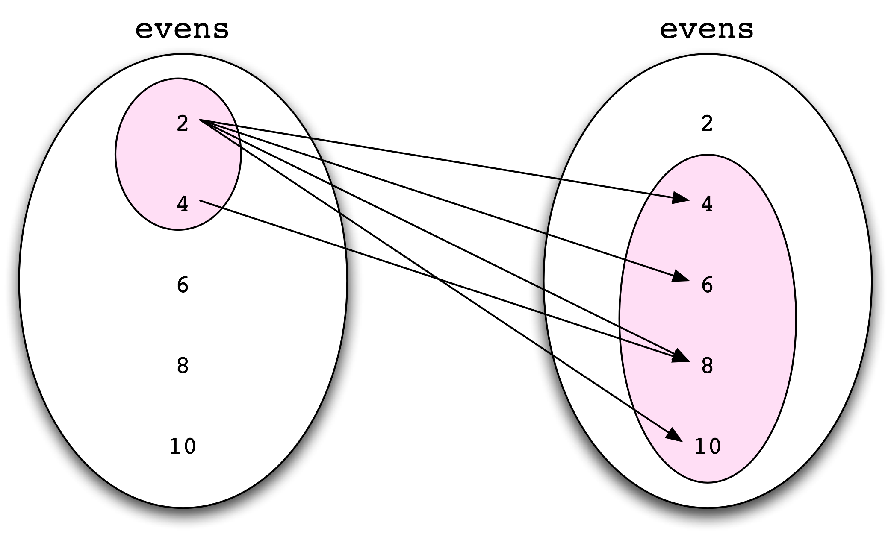

.. -*- mode: rst -*-
.. include:: ../definitions.rst

===============================================
10. Analyzing the Meaning of Sentences (Extras)
===============================================

-------------------------------
Sets and Mathematical Functions
-------------------------------

Sets
----

A set is a collection of entities, called the `members`:dt: of the
set. Sets can be finite or infinite, or even empty.
In Python, we can define a set just by listing its members; the
notation is similar to specifying a list:

    >>> set1 = set(['a', 'b', 1, 2, 3])
    >>> set1
    set(['a', 1, 2, 'b', 3])

|nopar|
In mathematical notation, we would specify this set as:

.. ex:: {'a', 'b', 1, 2, 3}

Set membership is a relation |mdash| we can ask whether some entity
`x`:math: belongs to a set `A`:math: (in mathematical notation,
written `x`:math: |element| `A`:math:).

    >>> 'a' in set1
    True
    >>> 'c' in set1
    False

|nopar|
However, sets differ from lists in that they are `unordered`:em: collections.
Two sets are equal if and only if they have exactly the same members:

    >>> set2 = set([3, 2, 1, 'b', 'a'])
    >>> set1 == set2
    True

The `cardinality`:dt: of a set `A`:math: (written |pipe|\ `A`:math:\
|pipe|) is the number of members in `A`:math:. We can get this value
using the ``len()`` function:

    >>> len(set1)
    5

The argument to the ``set()`` constructor can be any sequence, including
a string, and just calling the constructor with no argument creates
the empty set (written |empty|).

    >>> set('123')
    set(['1', '3', '2'])
    >>> a = set()
    >>> b = set()
    >>> a == b
    True

We can construct new sets out of old ones. The `union`:dt: of two sets
`A`:math: and `B`:math: (written `A`:math: |union| `B`:math:) is the set
of elements that belong to `A`:math: or `B`:math:. Union is
represented in Python with ``|``:

    >>> odds = set('13579')
    >>> evens = set('02468')
    >>> numbers = odds | evens
    >>> numbers
    set(['1', '0', '3', '2', '5', '4', '7', '6', '9', '8'])

The `intersection`:dt: of two sets `A`:math: and `B`:math: (written
`A`:math: |intersect| `B`:math:) is the set of elements that belong
to both `A`:math: and `B`:math:. Intersection is represented in Python
with ``&``. If the intersection of two sets is empty, they are said to
be `disjoint`:dt:.

    >>> ints
    set(['1', '0', '2', '-1', '-2'])
    >>> ints & nats
    set(['1', '0', '2'])
    >>> odds & evens
    set([])

The `(relative) complement`:dt: of two sets `A`:math: and `B`:math: (written 
`A`:math: |diff| `B`:math:)  is the set of
elements that belong to `A`:math: but not `B`:math:. Complement is represented
in Python with ``-``. 

    >>> nats - ints
    set(['3', '5', '4', '7', '6', '9', '8'])
    >>> odds == nats - evens
    True
    >>> odds == odds - set()
    True

So far, we have described how to define 'basic' sets and how to form
new sets out of those basic ones. All the basic sets have been
specified by listing all their members. Often we want to specify set
membership more succinctly:

.. _ex-set1:
.. ex:: the set of positive integers less than 10

.. _ex_set2:
.. ex:: the set of people in Melbourne with red hair

|nopar| 
We can informally write these sets using the
following `predicate notation`:dt:\ :

.. _ex-set3:
.. ex:: {`x`:math: | `x`:math: is a positive integer less than 10}

.. _ex-set4:
.. ex:: {`x`:math: | `x`:math: is a person in Melbourne with red hair}

In axiomatic set theory, the axiom schema of comprehension states that
given a one-place predicate `P`:math:, there is set `A`:math: such
that for all `x`:math:, `x`:math: belongs to `A`:math: if and only if
(written |iff|) `P(x)`:math: is true:

.. _ex-compax:
.. ex:: |exists|\ `A`:math:\ |forall|\ `x`:math:.(`x`:math: |element|
        `A`:math: |iff| `P(x)`:math:\ )

|nopar| 
From a computational point of view, ex-compax_ is
problematic: we have to treat sets as finite objects in the computer,
but there is nothing to stop us defining infinite sets using
comprehension. Now, there is a variant of ex-compax_, called the axiom of
restricted comprehension, that allows us to specify a set `A`:math:
with a predicate `P`:math: so long as we only consider `x`:math:\ s
which belong to some `already defined set`:em: `B`:math:\:

.. _ex-comprax:
.. ex:: |forall|\ `B`:math: |exists|\ `A`:math:\ |forall|\ `x`:math:.
        (`x`:math: |element| `A`:math: |iff| `x`:math: |element|
        `B`:math: |wedge|  `P(x)`:math:\ )

|nopar| (For all sets `B`:math: there is a set `A`:math: such that for all
`x`:math:, `x`:math: belongs to `A`:math: if and only if `x`:math:
belongs to `B`:math: and `P(x)`:math: is true.)
This is equivalent to the following set in predicate notation:

.. ex:: {`x`:math: | `x`:math: |element| `B`:math: |wedge| `P(x)`:math:\ )

|nopar|
ex-comprax_ corresponds pretty much to what we get with list
comprehension in Python: if you already have a list, then you can
define a new list in terms of the old one, using an ``if``
condition. In other words, ex-listcomp_ is the Python counterpart of
ex-comprax_.

.. _ex-listcomp:
.. ex:: ``set([x for x in B if P(x)])``

To illustrate this further, the following list comprehension relies on
the existence of the previously defined set ``nats`` (``n % 2`` is the
remainder when ``n`` is divided by ``2``):

   >>> nats = set(range(10))
   >>> evens1 = set([n for n in nats if n % 2 == 0])
   >>> evens1
   set([0, 8, 2, 4, 6])

|nopar| Now, when we defined ``evens`` before, what we actually had
was a set of `strings`:em:, rather than Python integers. But we can
use ``int`` to coerce the strings to be of the right type:

   >>> evens2 = set([int(n) for n in evens])
   >>> evens1 == evens2
   True

If every member of `A`:math: is also a member of `B`:math:, we say
that `A`:math: is a subset of `B`:math: (written `A`:math: |subset|
`B`:math:). The subset relation is represented
in Python with ``<=``. 

    >>> evens1 <= nats
    True
    >>> set() <= nats
    True
    >>> evens1 <= evens1
    True

As the above examples show, `B`:math: can contain more members than
`A`:math: for `A`:math: |subset|
`B`:math: to hold, but this need not be so. Every set is a subset of
itself. To exclude the case where a set is a subset of itself, we use
the relation `proper subset`:dt: (written `A`:math: |propsubset|
`B`:math:). In Python, this relation is represented as ``<``.

    >>> evens1 < nats
    True
    >>> evens1 < evens1
    False

Sets can contain other sets. For instance, the set `A`:math: =
{{`a`:math:}, {`b`:math:} } contains the two singleton sets
{`a`:math:} and {`b`:math:}. Note that {`a`:math:} |subset| `A`:math:
does not hold, since `a`:math: belongs to {`a`:math:} but not
to `A`:math:. In Python, it is a bit more awkward to specify sets
whose members are also sets; the latter have to be defined as
``frozenset``\ s, i.e., immutable objects.

    >>> a = frozenset('a')
    >>> aplus = set([a])
    >>> aplus
    set([frozenset(['a'])])

We also need to be careful to distinguish between the empty set |empty| and
the set whose only member is the empty set: {|empty|}.

Tuples
------

We write |langle|\ `x`:math:\ :sub:`1`, |dots|\ , `x`:math:\ :sub:`n`\
|rangle| for the `ordered n-tuple`:dt: of objects 
`x`:math:\ :sub:`1`, |dots|\ , `x`:math:\ :sub:`n`, where `n`:math:
|geq| 0. These are exactly the same as Python tuples. Two tuples are
equal only if they have the same lengths, and the same objects in the
same order.

    >>> tup1 = ('a', 'b', 'c')
    >>> tup2 = ('a', 'c', 'b')
    >>> tup1 == tup2
    False

|nopar| A tuple with just 2 elements is called an `ordered pair`:dt:, with
just three elements, an `ordered triple`:dt:, and so on.

Given two sets `A`:math: and `B`:math:, we can form a set of ordered
pairs by drawing the first member of the pair from `A`:math: and the
second from `B`:math:. The `Cartesian product` of  `A`:math: and
`B`:math:, written `A`:math: |times| `B`:math:, is the set of all such
pairs. More generally, we have for any sets 
`S`:math:\ :sub:`1`, |dots|\ , `S`:math:\ :sub:`n`,

.. ex:: `S`:math:\ :sub:`1` |times| |dots| |times| `S`:math:\ :sub:`n` 
        = {|langle|\ `x`:math:\ :sub:`1`, |dots|\ , `x`:math:\ :sub:`n`\
        |rangle| |pipe| `x`:math:\ :sub:`i` |element| `S`:math:\ :sub:`i`}

In Python, we can build Cartesian products using list
comprehension. As you can see, the sets in a Cartesian product don't
have to be distinct.

    >>> A = set([1, 2, 3])
    >>> B = set('ab')
    >>> AxB = set([(a, b) for a in A for b in B])
    >>> AxB
    set([(1, 'b'), (3, 'b'), (3, 'a'), (2, 'a'), (2, 'b'), (1, 'a')])
    >>> AxA = set([(a1, a2) for a1 in A for a2 in A])
    >>> AxA
    set([(1, 2), (3, 2), (1, 3), (3, 3), (3, 1), (2, 1),
    (2, 3), (2, 2), (1, 1)])

.. mention S |sup|`n` ?

Relations and Functions
-----------------------

In general, a `relation`:dt: `R`:math: is a set of tuples. For
example, in set-theoretic terms, the binary relation `kiss`:lx:
is the set of all ordered pairs |langle|\ `x`:math:, `y`:math:\
|rangle| such that `x kisses y`:lx:. More formally, an `n-ary
relation`:dt: over sets `S`:math:\ :sub:`1`, |dots|\ , `S`:math:\
:sub:`n` is any set `R`:math: |subset| `S`:math:\ :sub:`1` |times|
|dots| |times| `S`:math:\ :sub:`n`.

Given a binary relation `R`:math: over two sets `A`:math: and
`B`:math:, not everything in `A`:math: need stand in the `R`:math:
relation to something in `B`:math:. As an illustration, consider the
set ``evens`` and the relation ``mod`` defined as follows:

    >>> evens = set([2, 4, 6, 8, 10])
    >>> mod = set([(m,n) for m in evens for n in evens if n % m == 0 and m < n])
    >>> mod
    set([(4, 8), (2, 8), (2, 6), (2, 4), (2, 10)])

|nopar| Now, ``mod`` |subset| ``evens`` |times| ``evens``, but there
are elements of ``evens``, namely ``6``, ``8`` and ``10``, that do
not stand in the ``mod`` relation to anything else in ``evens``. In
this case, we say that only ``2`` and ``4`` are in the `domain`:dt: of
the ``mod`` relation. More formally, for a relation `R`:math: over
`A`:math: |times| `B`:math:, we define

.. ex::  `dom(R) = {x`:math: |pipe| |exists|\ `y.`:math:\
         |langle|\ `x`:math:, `y`:math:\ |rangle| |element|  
         `A`:math: |times| `B`:math:\ }
         
|nopar| Correspondingly, the set of entities in `B`:math: which are the second
member of a pair in `R`:math: is called the `range`:dt: of `R`:math:,
written `ran(R)`:math:.
 
We can visually represent the relation ``mod`` by drawing arrows to
indicate elements that stand in the relation, as shown in fig-modrel_.

.. _fig-modrel:

   Visual Representation of a Relation

|nopar| The domain and range of the relation are shown as shaded areas
in fig-modrel_.

.. 
   For sets `A`:math: and `B`:math:, a (set-theoretic) `function`:dt:
   from `A`:math: to `B`:math: is a relation `f`:math: |subset| `A`:math:
   |times| `B`:math: such that for every `a`:math: |element| `A`:math:
   there is at most one `b`:math: |element| `B`:math: such that |langle|\
   `a`:math:, `b`:math:\ |rangle|.
   Thus, the ``mod`` relation is not a function, since the element ``2``
   is paired with four items, not just one. By contrast, the relation
   ``addtwo`` defined as follows `is`:em: a function:

A relation `R`:math: |subset| `A`:math: |times| `B`:math: is a 
(set-theoretic) `function`:dt: just in case it meets the following
two conditions:

1. For every `a`:math: |element| `A`:math: there is at most one
   `b`:math: |element| `B`:math: such that |langle|\ `a`:math:,
   `b`:math:\ |rangle|.

2. The domain of  `R`:math: is equal to `A`:math:.

|nopar| Thus, the ``mod`` relation defined earlier is not a function, since
the element ``2`` is paired with four items, not just one. By
contrast, the relation ``doubles`` defined as follows `is`:em: a
function:

    >>> odds = set([1, 2, 3, 4, 5])
    >>> doubles = set([(m,n) for m in odds for n in evens if n == m * 2])
    >>> doubles
    set([(1, 2), (5, 10), (2, 4), (3, 6), (4, 8)])

If `f`:math: is a function |subset| `A`:math: |times| `B`:math:, then
we also say that `f`:math: is a function from `A`:math: to
`B`:math:. We also write this as `f`:math:\ : `A`:math: |mapsto|
`B`:math:. If |langle|\ `x`:math:, `y`:math:\ |rangle| |element|
`f`:math:, then we write `f(x) = y`:math:. Here, `x`:math: is called
an `argument`:dt: of `f`:math: and `y`:math: is a `value`:dt:. In such
a case, we may also say that `f`:math: maps `x`:math: to `y`:math:.

Given that functions always map a given argument to a single value, we
can also represent them in Python using dictionaries (which
incidentally are also known as `mapping`:dt: objects). The
``update()`` method on dictionaries can take as input any iterable of
key/value pairs, including sets of two-membered tuples:

    >>> d = {}
    >>> d.update(doubles)
    >>> d
    {1: 2, 2: 4, 3: 6, 4: 8, 5: 10}

A function `f`:math:\ : `S`:math:\ :sub:`1` |times| |dots| |times|
`S`:math:\ :sub:`n` |mapsto| `T`:math: is called an `n-ary`:dt:
function; we usually write `f`:math:\ (`s`:math:\ :sub:`1`, |dots|,
`s`:math:\ :sub:`n`) rather than `f`:math:\ (|langle|\ `s`:math:\
:sub:`1`, |dots|, `s`:math:\ :sub:`n`\ |rangle|\ ). For sets `A`:math:
and `B`:math:, we write `A`:math:\ :sup:`B` for the set of all
functions from `A`:math: to `B`:math:, that is {`f`:math: |pipe| `f:
A`:math: |mapsto| `B`:math:}.
If `S`:math: is a set, then we can define a corresponding function
`f`:math:\ :sub:`S` called the `characteristic function`:dt: of
`S`:math:, defined as follows:

.. ex:: | `f`:math:\ :sub:`S`\ `(x)`:math: = True if `x`:math: |element| `S`:math:
    | `f`:math:\ :sub:`S`\ `(x)`:math: = False if `x`:math: |nelement| `S`:math:

|nopar| `f`:math:\ :sub:`S` is a member of the set {\ *True*, *False*\
}\ :sup:`S`.

It can happen that a relation meets condition (1) above but fails
condition (2); such relations are called `partial functions`:dt:. For
instance, let's slightly modify the definition of ``doubles``:

    >>> doubles2 = set([(m,n) for m in evens for n in evens if n == m * 2])
    >>> doubles2
    set([(2, 4), (4, 8)])

|nopar| ``doubles2`` is a partial function since its domain is a proper subset of
``evens``. In such a case, we say that ``doubles2`` is `defined`:dt:
for ``2`` and ``4`` but  `undefined`:dt: for the other elements in
``evens``.

Exercises
---------

#. |easy| For each of the following sets, write a specification by hand in
   predicate notation, and an implementation in Python using list
   comprehension.

   a. {2, 4, 8, 16, 32, 64}

   b. {2, 3, 5, 7, 11, 13, 17}

   c. {0, 2, -2, 4, -4, 6, -6, 8, -8}

#. |easy| The `powerset`:dt: of a set `A`:math: (written |power|\ `A`:math:\ ) is
   the set of all subsets of `A`:math:, including the empty set. List
   the members of the following sets:

   a.  |power|\ {`a`:math:, `b`:math:, `c`:math:\ }:

   b.  |power|\ {`a`:math:\ }

   c.  |power|\ {|empty|}

   d.  |power|\ |empty|

#. |soso| Write a Python function to compute the powerset of an arbitrary
   set. Remember that you will have to use ``frozenset`` for this.

#. |easy| Consider the relation ``doubles``, where ``evens`` is defined as in
   the text earlier:

     >>> doubles = set([(m,m*2) for m in evens])

   Is ``doubles`` a relation over ``evens``? Explain your answer.

#. |soso| What happens if you try to update a dictionary with a relation
   that is `not`:em: a function? 

#. |easy| Write a couple of Python functions that, for any set of pairs `R`:math:,
   return the domain and range of `R`:math:.

#. |soso| Let `S`:math: be a family of three children, {Bart, Lisa,
   Maggie}. Define relations  `R`:math: |subset| `S`:math: |times| `S`:math:
   such that:

   a. `dom(R)`:math: |propsubset| `S`:math:;

   #. `dom(R)`:math: = `S`:math:;

   #. `ran(R)`:math: = `S`:math:;

   #. `ran(R)`:math: = `S`:math:;

   #. `R`:math: is a total function on `S`:math:.

   #. `R`:math: is a partial function on `S`:math:. 

#. |soso| Write a Python function that, for any set of pairs `R`:math:,
   returns ``True`` if and only if `R`:math: is a function.

.. include:: ../book/footer.rst
